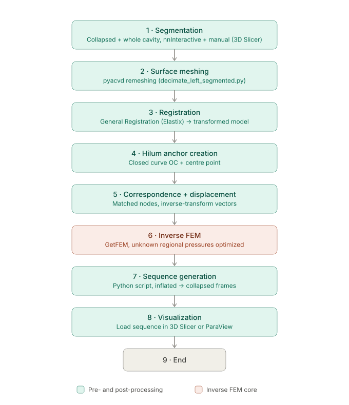

# Collapsed lung pipeline

From CT segmentations of a lung before and after collapse (VATS surgery) to the regional pleural pressures that reproduce the collapse in a finite-element model. The fitted simulations are the training data for a GNN surrogate.



| Step | Name in the config | Code | Main output |
|---|---|---|---|
| 1 · Segmentation | – (manual, 3D Slicer) | – | `Input_Data/<patient>/*.vtk` |
| 1b · Input check | `check_inputs` | [check_inputs.py](pipeline/check_inputs.py) | `checks/` |
| 2 · Surface meshing | `surface_mesh` | [surface_mesh.py](pipeline/surface_mesh.py) | `lung_collapsed_mesh.vtp` |
| 3 · Hilum anchor | `hilum` | [hilum.py](pipeline/hilum.py) | `hilum_anchor.mrk.json` |
| 4 · Registration | `registration` | [registration.py](pipeline/registration.py) | `lung_inflated_mesh.vtp` |
| 5a · FEM setup | `fem_setup` | [collapse/setup.py](pipeline/collapse/setup.py) | `fem/setup/problem.npz` |
| 5b · FEM fit | `fem_fit` | [collapse/fit.py](pipeline/collapse/fit.py) | `lung_fem_fit*.vtp` |
| 6 · Collapse sequence | separate script | [collapse_sequence.py](scripts/collapse_sequence.py) | `sequence*/` |
| 7 · Visualisation | 3D Slicer | [slicer_compare_sequences.py](scripts/slicer_compare_sequences.py) | – |

- **1b · Input check:** finds segmentation problems (open surfaces, collapsed lung outside the inflated one, narrow notches) before registration and Gmsh fail on them. Colour `checks/*.vtp` in Slicer to see where to fix.
- **2 · Surface meshing:** the collapsed lung is cleaned and remeshed uniformly to ~480 nodes. This node set is used by every later step.
- **3 · Hilum anchor:** where the airway, artery and vein trees enter the lung; their ring centres and the hilum are written as spheres for Slicer.
- **4 · Registration:** elastix (rigid + [affine] + B-spline) on the two lung masks, with the hilum as landmarks, moves the collapsed mesh onto the inflated lung. Node *i* of `lung_inflated_mesh.vtp` corresponds to node *i* of `lung_collapsed_mesh.vtp`.
- **5 · Inverse FEM:** see below.
- **6–7 · Collapse sequence and visualisation:** see [Viewing the results](#viewing-the-results).

## Repository layout

```
main.py              runs the steps listed in a config
configs/             one JSON per case (+ README.md: every key explained), elastix parameter files
pipeline/            steps 1b–4; collapse/ = step 5 (setup, fit, FEM cores in solvers/)
scripts/             collapse sequence, 3D Slicer loader, run_all.sh, validation tools
Input_Data/          patient data (not in git)
results/             outputs (not in git)
CLAUDE.md            development notes: details of every step, validation, open problems
```

## Setup

```bash
pip install -r requirements.txt
```

Requires Python ≥ 3.10.

`fem_fit` also needs the library of the FEM core selected in the config, which is not on PyPI and is imported only by that step:

- **GetFEM:** `conda install -c conda-forge getfem` (linux-64, osx-64, win-64), or on Ubuntu `apt install python3-getfem` with the system Python (built against `numpy<2`).
- **Warp:** `pip install warp-lang`, optionally `"nvmath-python[cu12]"` (cuDSS on GPU) and `pypardiso`.
- **PyTorch:** `pip install torch` (≥ 2.0, for `torch.func`), same optional linear solvers as Warp.

## Running

```bash
python main.py --config configs/patient_10.json                      # steps listed in the config
python main.py --config configs/patient_10.json --steps hilum        # only some steps
python main.py --config configs/patient_10.json --steps fem_fit      # e.g. on the machine with GetFEM
```

One-off changes without editing the config: `--set section.key=value ...` (value parsed as JSON), e.g. `python main.py --config configs/karl04_torch.json --set fem_fit.loss=plane fem_fit.run_name=fit_torch_plane fem_fit.output=lung_fem_fit_torch_plane.vtp`; a misspelt key is rejected as in the file, and the overrides are written to the log.

All cases at once (each base config, then its `_warp` / `_torch` variants; cases in parallel, logs in `logs_run_all/`): `bash scripts/run_all.sh [case ...]`, with `CORES="warp torch"` to skip the GetFEM fits.

Steps always run in pipeline order. If a step fails, the error is written to `logs/pipeline.log` and the run stops.

## Input data

One folder per patient in `Input_Data/`, surface models exported from 3D Slicer (`.vtk`): the collapsed lung (`lung_left_collapsed.vtk`), the inflated lung (`lung_left.vtk`) and the airway, artery and vein trees (`lung_airways.vtk`, `lung_arteries.vtk`, `lung_veins.vtk`). `left` / `right` as for the patient.

## Configuration

One JSON per case in [`configs/`](configs/); **every key, with its purpose and range, is explained in [`configs/README.md`](configs/README.md).**

Each case comes in two sets, without and with the cavity wall, each with three FEM cores:

| Config | Wall | FEM core | Runs |
|---|---|---|---|
| `<p>.json` | no | GetFEM | the whole pipeline → `results/<p>/` |
| `<p>_warp.json`, `<p>_torch.json` | no | Warp, PyTorch | only `fem_fit`, on the setup of `<p>.json` |
| `<p>_wall.json` (+ `_warp`, `_torch`) | yes | as above | → `results/<p>_wall/` |


## Inverse FEM



- **`fem_setup`** (seconds): fixes the lung at the hilum and the vessel entries plus the points that barely move, aligns the collapsed lung on them, splits the surface into pressure regions (1 → 40) and builds the tetrahedral mesh.
- **`fem_fit`** (1–2 min with Warp / PyTorch on GPU): finds the pressure of each region so that the inflated lung, pushed by them, matches the collapsed one; coarse to fine, with an exact Jacobian. GetFEM, Warp and PyTorch solve the same model and are interchangeable (`fem_fit.solver`).
- **Result:** `lung_fem_fit*.vtp` (the fitted surface, with `Error_mm`, `Pressure_Pa`, `Clamped`) and `fem/<run_name>/result_summary.json` (errors on the free points, pressures, rotation, timing).

## Viewing the results

**One case, animated:**

```bash
python scripts/collapse_sequence.py --config configs/<p>_torch.json      # where the FEM core is installed
```

writes `results/<p>/sequence_fit_torch/` (frames, target, hilum, and `load_collapse_in_slicer.py`). Copy the folder to the machine with Slicer (`tar -czf seq.tar.gz results/<p>/sequence_fit_torch`) and open it:

```bash
/Applications/Slicer.app/Contents/MacOS/Slicer --python-script <folder>/load_collapse_in_slicer.py
```

or, with Slicer open, in its Python console:

```python
p = '<folder>/load_collapse_in_slicer.py'
exec(open(p).read(), {'__file__': p})
```

**Several fits side by side** (e.g. two losses), in Slicer's Python console:

```python
exec(open('<repo>/scripts/slicer_compare_sequences.py').read())
load('<results>/karl04/sequence_fit_torch', '<results>/karl04/sequence_fit_torch_plane')
```

**Static:** drag `lung_fem_fit_torch.vtp` and `fem/setup/target_aligned.vtp` into Slicer and colour the fit by `Error_mm`.

## Outputs

```
results/<p>/
├── lung_collapsed_mesh.vtp     collapsed lung, remeshed (step 2)
├── hilum_anchor.mrk.json       hilum + airway / artery / vein entries (step 3)
├── lung_inflated_mesh.vtp      inflated lung, same nodes (step 4)
├── lung_fem_fit*.vtp           fitted surface (step 5)
├── sequence*/                  collapse sequence for Slicer / ParaView (step 6)
├── checks/  hilum/  registration/
├── fem/setup/                  problem.npz, reference.vtp, target_aligned.vtp, volume.vtu
├── fem/<run_name>/             result_summary.json, history.csv, best_state.npz
└── logs/                       pipeline.log, config used
```

All surfaces are in LPS, with the space stored in the file. Details of each step, validation results and open problems: [CLAUDE.md](CLAUDE.md).
